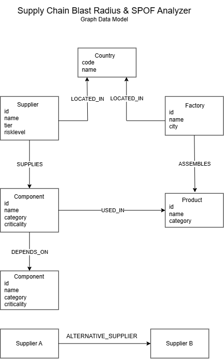

# Supply Chain Blast Radius & SPOF Analyzer

A graph-powered analytics platform for identifying supply chain vulnerabilities using Neo4j/CognoDB and Next.js.

## Problem Statement

Modern supply chains are highly interconnected.

When a supplier fails, organizations need to quickly answer:

- Which products are affected?
- Which components become unavailable?
- Are there single points of failure?
- What risks exist in specific countries?

Traditional relational databases struggle to answer these dependency-traversal questions efficiently.

This project uses a graph database model to analyze supplier, component, product, factory, and country relationships.

---

## Features

### Blast Radius Analysis

Determine which products are affected if a supplier becomes unavailable.

### Single Point of Failure (SPOF) Detection

Identify suppliers that provide critical components without alternative suppliers.

### Country Risk Analysis

Analyze supply chain exposure by country.

### Interactive Dashboard

- KPI cards
- SPOF monitoring
- Blast radius exploration
- Country risk analysis

---

## Technology Stack

### Frontend

- Next.js 16
- React 19
- TypeScript
- Tailwind CSS
- shadcn/ui

### Backend

- Next.js Route Handlers
- TypeScript

### Database

- Neo4j Compatible Graph Database
- CognoDB
- Cypher Query Language

---

## Graph Data Model



### Nodes

- Supplier
- Component
- Product
- Factory
- Country

### Relationships

- SUPPLIES
- DEPENDS_ON
- USED_IN
- ASSEMBLES
- LOCATED_IN
- ALTERNATIVE_SUPPLIER

---

## API Endpoints

### SPOF Analysis

GET

/api/spof

### Blast Radius

GET

/api/blast-radius/:supplierId

Example:

/api/blast-radius/SUP001

### Country Risk

GET

/api/country-risk/:countryCode

Example:

/api/country-risk/CN

### Metadata

GET

/api/metadata

---

## Dashboard

### Overview


### SPOF Analysis


### Blast Radius


### Country Risk


---

## Local Setup

Install dependencies:

```bash
npm install
```

Configure environment variables:

```env
COGNODB_URI=
COGNODB_USERNAME=
COGNODB_PASSWORD=

NEXT_PUBLIC_APP_URL=
```

Run:

```bash
npm run dev
```

---

## Database Setup

Create constraints:

```bash
npm run constraints:db
```

Seed data:

```bash
tsx src/scripts/seed.ts
```

Verify:

```bash
tsx src/scripts/verify-seed.ts
```

---

## Future Enhancements

- Graph visualization
- Risk scoring model
- Supplier tier analysis
- Real-time monitoring
- Scenario simulation
